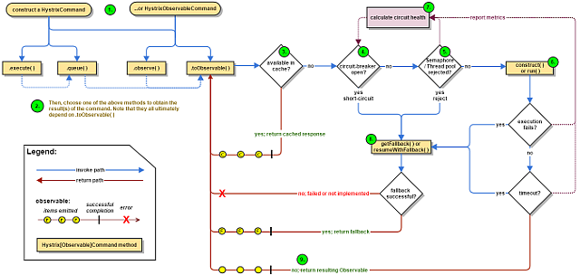

## 配置springboot热部署
1. 在pom.xml中增加maven配置
```aiignore
        <dependency>
            <groupId>org.springframework.boot</groupId>
            <artifactId>spring-boot-devtools</artifactId>
            <scope>runtime</scope>
            <optional>true</optional>
        </dependency>
```
2. 在主启动类的vm参数中增加
```aiignore
-Dspring.devtools.restart.enabled=true
-Dspring.devtools.livereload.enabled=true
```
3. 在主启动类的配置中


---
## CAP

### **一、CAP 理论是什么？**

CAP = Consistency（强一致性）、Availability（可用性）、Partition Tolerance（分区容错性）

在 分布式系统中，P（分区容错性）是必须的，因此实际选择是：

👉 CP（强一致性 + 分区容错）

👉 AP（可用性 + 分区容错）

分区指网络不通、多节点之间通信异常。
你不能同时保证 C 和 A，只能根据需求二选一。

| **字母** | **全称**            | **中文**   | **含义**                                           |
| -------- | ------------------- | ---------- | -------------------------------------------------- |
| **C**    | Consistency         | 一致性     | 所有节点的数据必须保持一致（强一致）               |
| **A**    | Availability        | 可用性     | 每个请求都必须在合理时间内返回（不超时）           |
| **P**    | Partition Tolerance | 分区容错性 | 系统能容忍网络分区（节点间不通），依然继续提供服务 |

#### 1. C - Consistency（一致性）

**✔ 定义**

无论访问哪个节点，你读到的数据都是相同的。

写入必须立即同步到所有节点。

**✔ 示例**

你往 Kafka / Redis / MySQL （主从集群）写入：

```
count = 100
```

立刻读：

- 从节点 A 读 = 100
- 从节点 B 读 = 100

**所有节点数据保持一致 = 强一致性（Strong Consistency）**

### **✔ 实际效果**

- 每次写操作都需要全网同步
- 网络分区时必须拒绝请求（否则可能造成数据冲突）

👉 一致性优先意味着：**不能保证每次都可用**

#### 2. A - Availability（可用性）

**✔定义**

系统在合理时间（一般毫秒级）必须响应每一个请求，无论当前状态是否一致。

“只要我请求你，你不能拒绝我。”

**✔示例**

在网络分区时，即使数据不同步，服务仍然：

- **能返回响应**
- **不报错，不超时**

**✔ 实际效果**

为了保证可用性：

- 不需要全网同步
- 可以返回旧数据
- 网络分区时仍然工作

👉 可用性优先意味着：**不保证一致性**（可能读取到旧数据）


#### 3.这里重点介绍一下 P (分区容错性):

**✔ 定义**

在分布式系统中，节点之间可能因为网络出现“分区”（Partition），例如：
•	网络断开
•	包丢失
•	机房之间网络延迟急剧升高

P 表示系统必须在这种情况下还保持可运行性。

**✔ 示例**

节点 A、B 正常
节点 C 因网络隔离单独一边

分区容错系统要求：
•	A/B 继续服务
•	C 也继续服务
•	分区期间系统不会完全瘫痪

👉 分布式系统 一定要保证 P，因为网络分区不可避免。


### **二、Spring Cloud 中常见组件的 CAP 类型**

| **组件**                  | **功能**      | **CAP 类型**                        | **为什么**                                                   |
| ------------------------- | ------------- | ----------------------------------- | ------------------------------------------------------------ |
| **Eureka（Netflix）**     | 注册中心      | **AP**                              | 网络分区时仍可提供查询服务，优先保证可用性，但会产生短暂不一致（实例信息延迟） |
| **Consul（HashiCorp）**   | 注册+KV       | **CP**                              | 采用 Raft 强一致性协议，保证一致性，分区下读写可能失败，不保证可用性 |
| **Nacos（Alibaba）**      | 注册+配置中心 | **CP（注册）** / **AP（配置推送）** | 注册模式可选（CP=Raft，AP=Distro），配置中心偏向 AP          |
| **Zookeeper**             | 协调、注册    | **CP**                              | 采用 ZAB（写一致性），分区下写不可用                         |
| **Spring Cloud Config**   | 配置中心      | **AP**                              | 配置读取可用，但更新可能延迟不同步（依赖 Git）               |
| **Spring Cloud Gateway**  | API 网关      | **A（单点）**                       | 主要是路由转发组件，不涉及一致性问题                         |
| **Ribbon / LoadBalancer** | 负载均衡      | **A（本地缓存）**                   | 本地缓存实例，不要求一致性                                   |
| **OpenFeign**             | 服务调用      | **N/A（client 组件）**              | 没有 CAP 属性，是调用工具                                    |

### 最标准总结

| **组件**                     | **CAP**                     | **解释**               |
| ---------------------------- | --------------------------- | ---------------------- |
| **Eureka**                   | **AP**                      | 自我保护，不保证一致性 |
| **Consul**                   | **CP**                      | 强一致，分区时不可用   |
| **Zookeeper**                | **CP**                      | 强一致                 |
| **Nacos 注册中心**           | **可选 AP / CP（默认 AP）** | 可配置模式             |
| **Nacos 配置中心**           | **AP**                      | 推送模式               |
| **Spring Cloud Config**      | **AP**                      | 配置中心延迟一致       |
| **Gateway / Ribbon / Feign** | N/A                         | 无 CAP 属性            |

## Ribbon 负载均衡
- 集中式(服务器负载均衡):就是所有的请求都会打到一个服务上(例如Nginx,或者硬件F5),再由这个服务统一分发请求
- 进程内(本地负载均衡):在调用微服务接口时，通过组件(Ribbon)先去注册中心获取注册服务列表并缓存到本地JVM中，从而在本地实现RPC远程调用

Ribbon负载均衡的实现：@LoadBalanced + RestTemplate
```java
    @Bean
    @LoadBalanced
    public RestTemplate restTemplate() {
        return new RestTemplate();
    }
```
RestTemplate 说明：
1. getForObject：返回对象为响应体中数据转化的对象，一般都是JSON格式
2. getForEntity：返回对象是ResponseEntity对象，包含响应中的一些重要信息，比如：响应头、状态码、响应体等
---
## consul 注册中心
consul 是一个分布式服务注册和配置管理系统，基于 HashiCorp 开源的 Consul，是一个分布式服务发现和配置系统。

启动命令：consul agent -dev

consul 架构：
- **Consul Server**：Consul 服务器，负责存储服务注册信息，并管理服务注册和注销。
- **Consul Client**：Consul 客户端，负责向 Consul 服务器注册服务，并获取服务信息。
- **Consul Agent**：Consul 代理，负责服务注册和发现，并代理 Consul 服务。
- **Consul UI**：Consul 用户界面，用于查看 Consul 服务注册信息。
- **Consul DNS**：Consul DNS，用于将服务名称解析为 IP 地址。
- **Consul KV**：Consul 键值对，用于存储配置信息。
- **Consul ACL**：Consul 访问控制列表，用于限制对 Consul 服务的访问。
- **Consul Catalog**：Consul 目录，用于查看 Consul 服务注册信息。
- **Consul Transit Gateway**：Consul 转发网关，用于将服务请求转发到其他服务。
- **Consul Connect**：Consul 连接，用于将服务与 Consul 服务进行集成。
- **Consul Mesh**：Consul Mesh，用于将服务集成到 Consul 中，并实现服务间通信。
- **Consul Enterprise**：Consul 企业版，提供了更多的功能，如：服务 mesh、数据加密、访问控制等。
- **Consul Integration**：Consul 集成，用于将 Consul 服务与第三方服务进行集成。
- **Consul Plugin**：Consul 插件，用于扩展 Consul 功能。
---
## Hystrix 断路器
### Hystrix 介绍
- **断路器模式**：在分布式系统中，某个服务不可用时，通过断路器模式来防止整个系统的崩溃。Hystrix 是 Netflix 开发的断路器实现。
- **隔离机制**：Hystrix 通过线程池或信号量来隔离服务调用，防止一个服务的故障影响到其他服务。
- **降级处理**：当服务调用失败时(由HystrixCommand中的参数配置，在一定时间内失败次数超过配置的次数时触发熔断)，Hystrix 会自动执行降级策略(兜底方法)，如返回默认值或调用 fallback 方法。
注意：熔断开启后如果调用服务成功，服务并不是一下就好，而是会恢复到半正常状态，需要等待一段时间后(默认5s)。熔断器会尝试再发一次请求，如果成功，则熔断器关闭。
### 熔断器流程图


The following sections will explain this flow in greater detail:

1. Construct a HystrixCommand or HystrixObservableCommand Object
2. Execute the Command
3. Is the Response Cached?
4. Is the Circuit Open?
5. Is the Thread Pool/Queue/Semaphore Full?
6. HystrixObservableCommand.construct() or HystrixCommand.run()
7. Calculate Circuit Health
8. Get the Fallback
9. Return the Successful Response
### 熔断器状态转换

---
## Gateway网关
- **API 网关**：API 网关是一个用于处理 API 请求的代理服务器，通常用于负载均衡、认证、限流、缓存、日志记录等。
- **API 网关和负载均衡**：API 网关通常与负载均衡一起使用，负载均衡负责将请求分发给后端服务，而 API 网关负责处理 API 请求，并返回结果。
- **API 网关和负载均衡的比较**：
  - 负载均衡：负载均衡负责将请求分给后端服务，通常使用轮询、权重、最少连接数等方式进行负载均衡。
  - API 网关：API 网关负责处理 API 请求，通常使用过滤器、路由、熔断、限流、缓存、日志记录等。
- **Spring Cloud Gateway**：Spring Cloud Gateway 是一个基于 Spring Framework 5、Spring Boot 2 和 Project Reactor 的 API 网关，提供了路由、过滤器、熔断、限流、缓存、日志记录等功能。
- **Spring Cloud Gateway 和 Netflix Zuul 的比较**：
  - 性能：Spring Cloud Gateway 基于 Reactor，性能更高。
  - 功能：Spring Cloud Gateway 提供了更多的功能，如路由、过滤器、熔断、限流、缓存、日志记录等。
  - 易用性：Spring Cloud Gateway 更易于使用，配置更简单。

### Spring Cloud Gateway 的使用：
- 添加依赖：在 pom.xml 中添加 Spring Cloud Gateway 依赖。
```aiignore
注意：这里不需要添加 spring-boot-starter-web 和 spring-boot-starter-actuator ，因为 Spring Cloud Gateway 已经包含了这两个依赖。否则会冲突
```
- 配置路由：在 application.yml 中配置路由规则。
- 使用过滤器：使用内置过滤器或自定义过滤器处理请求。
- 启动网关：启动 Spring Boot 应用程序，访问 API 网关
```aiignore
比如原来的服务地址是 http://localhost:8001/payment/get/31 ，现在改为 http://localhost:9527/payment/get/31
```