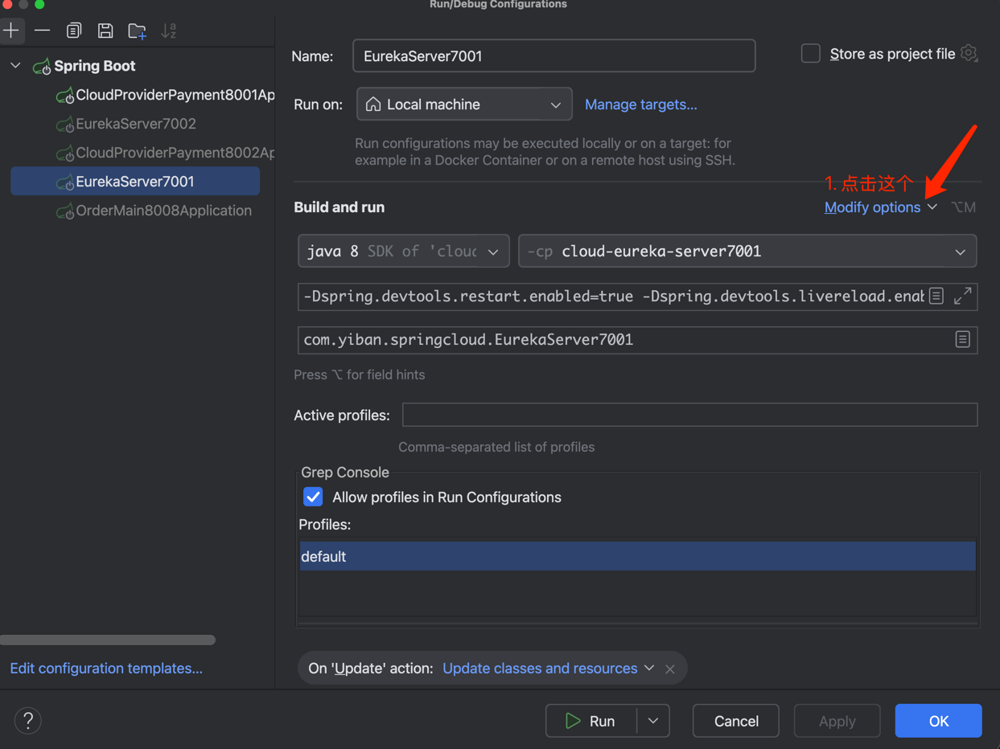
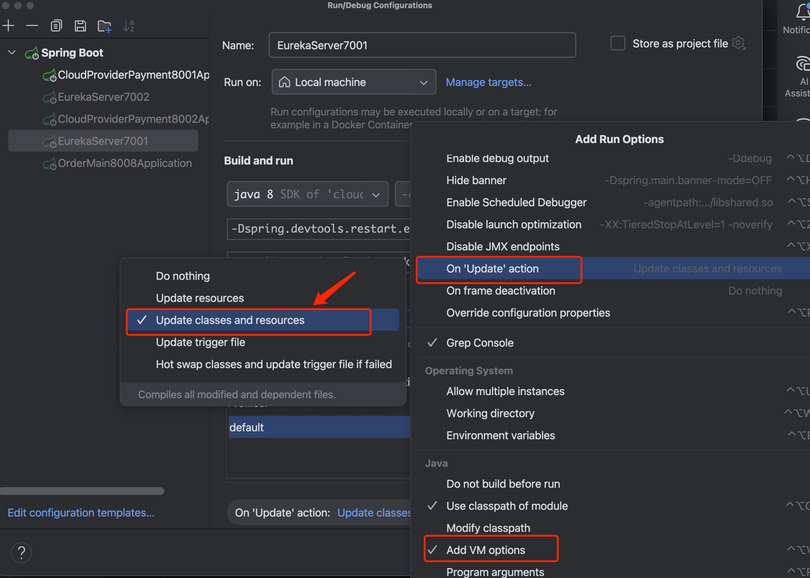

## 配置springboot热部署
1. 在pom.xml中增加maven配置
```aiignore
        <dependency>
            <groupId>org.springframework.boot</groupId>
            <artifactId>spring-boot-devtools</artifactId>
            <scope>runtime</scope>
            <optional>true</optional>
        </dependency>
```
2. 在主启动类的vm参数中增加
```aiignore
-Dspring.devtools.restart.enabled=true
-Dspring.devtools.livereload.enabled=true
```
3. 在主启动类的配置中


---
## CAP

### **一、CAP 理论是什么？**

CAP = Consistency（强一致性）、Availability（可用性）、Partition Tolerance（分区容错性）

在 分布式系统中，P（分区容错性）是必须的，因此实际选择是：

👉 CP（强一致性 + 分区容错）

👉 AP（可用性 + 分区容错）

分区指网络不通、多节点之间通信异常。
你不能同时保证 C 和 A，只能根据需求二选一。

| **字母** | **全称**            | **中文**   | **含义**                                           |
| -------- | ------------------- | ---------- | -------------------------------------------------- |
| **C**    | Consistency         | 一致性     | 所有节点的数据必须保持一致（强一致）               |
| **A**    | Availability        | 可用性     | 每个请求都必须在合理时间内返回（不超时）           |
| **P**    | Partition Tolerance | 分区容错性 | 系统能容忍网络分区（节点间不通），依然继续提供服务 |

#### 这里重点介绍一下 P (分区容错性):
✔ 定义

在分布式系统中，节点之间可能因为网络出现“分区”（Partition），例如：
•	网络断开
•	包丢失
•	机房之间网络延迟急剧升高

P 表示系统必须在这种情况下还保持可运行性。

✔ 示例

节点 A、B 正常
节点 C 因网络隔离单独一边

分区容错系统要求：
•	A/B 继续服务
•	C 也继续服务
•	分区期间系统不会完全瘫痪

👉 分布式系统 一定要保证 P，因为网络分区不可避免。


### **二、Spring Cloud 中常见组件的 CAP 类型**

| **组件**                  | **功能**      | **CAP 类型**                        | **为什么**                                                   |
| ------------------------- | ------------- | ----------------------------------- | ------------------------------------------------------------ |
| **Eureka（Netflix）**     | 注册中心      | **AP**                              | 网络分区时仍可提供查询服务，优先保证可用性，但会产生短暂不一致（实例信息延迟） |
| **Consul（HashiCorp）**   | 注册+KV       | **CP**                              | 采用 Raft 强一致性协议，保证一致性，分区下读写可能失败，不保证可用性 |
| **Nacos（Alibaba）**      | 注册+配置中心 | **CP（注册）** / **AP（配置推送）** | 注册模式可选（CP=Raft，AP=Distro），配置中心偏向 AP          |
| **Zookeeper**             | 协调、注册    | **CP**                              | 采用 ZAB（写一致性），分区下写不可用                         |
| **Spring Cloud Config**   | 配置中心      | **AP**                              | 配置读取可用，但更新可能延迟不同步（依赖 Git）               |
| **Spring Cloud Gateway**  | API 网关      | **A（单点）**                       | 主要是路由转发组件，不涉及一致性问题                         |
| **Ribbon / LoadBalancer** | 负载均衡      | **A（本地缓存）**                   | 本地缓存实例，不要求一致性                                   |
| **OpenFeign**             | 服务调用      | **N/A（client 组件）**              | 没有 CAP 属性，是调用工具                                    |

### 